# Limited Press Records

The website is for a business called Limited Press Records. 

Limited Press operates both as a physical record store selling vinyl records specialising in music from the independent and alternative music scene as well as a label releasing limited vinyl releases under their own name.
 
The website does not currently offer an online ordering system and for now is meant to encourage people to visit the store so the site acts as an information point for people wishing to know more about their releases and in-store events via social media feeds.

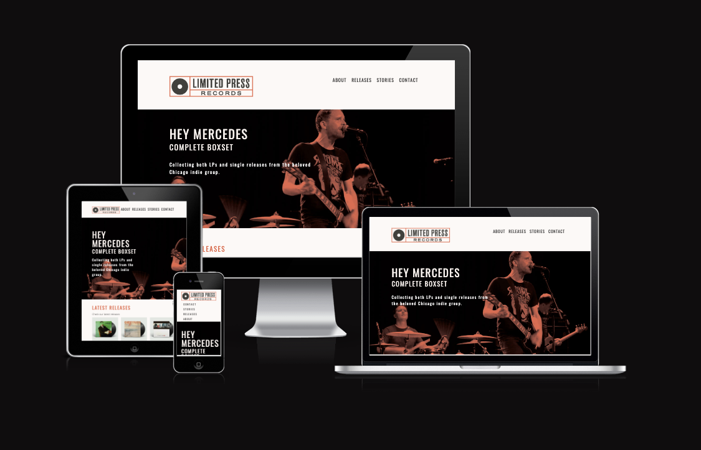

## 1. Features 

- __Navigation Bar__

  - A consistently designed navigation bar that appears on all of the site pages and allows visitors to navigate easily from one section of the site to another.

- __Footer__

  - A common footer will also appear on the bottom of every page with links to social media accounts.

- __Hero Image__

  - A unique hero image on every page for graphic impact as well as means of highlighting what page the visitor is on.

- __About__

  - A page to give some historical background of the business, its ethos, what it aims to do in the future and to encourage people to visit or contact the business.

- __Stories__

  - A ‘Stories’ section that highlights a particular artist and their release as a means of giving fans an inside look into the creation of that album and the artist process and thoughts on the release. This page would act as a gateway page listing the various artist interviews that would then link to the individual interview pages.

- __Releases__

  - A ‘Release’ section that would list all the releases by the label that would then link to individual pages listing the information for a specific release.

- __Contact Page__

  - A ‘Contact’ page listing the store address, opening hours as well as a form to submit a message and the option to sign up for a newsletter.

## 2. Future features

- In the future an online shopping option would be implemented. The online shop would act as means of strictly selling the exclusive Limited Press releases to a wider audience due to their collector appeal. By limiting the online store to its own releases it would allow the business to have a better sense of its stock situation and would not need to worry about potential issues selling other label releases on their online platform.

- I would also like to add a social media feed such as Instragram or Twitter that would allow the business to quickly update customers about events or releases in the shop. I think that by including this feature it would allow the owners to quickly update customers without the need to go and edit the site for each news item. 

## 3. Typography and Colour Scheme

- I designed the logo for this website so the colour scheme and typography choices are influenced by the logo to create a consistent brand/style throughout.  Oswald is used for headings and emphasis text, I chose it for its bold and clean style to echo that of the logo and Open Sans for some contrast as well as good legibility.

- The colour scheme is minimalist with three colours used at maximum.  I chose these colours to allow for strong contrast and they are also influenced by colour schemes I have seen on similar independent record label sites ([Deep Elm](www.deepelm.com), [No Sleep](www.nosleeprecords.com),
[Artic Rodeo](www.arcticrodeorecordings.com) as three examples) and I wanted to create something similar as that would be the market the site it aimed at.

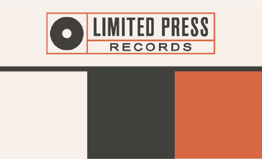

## 6. Wireframes

I started off doing my initial sketches on paper to develop the basic layout and site structure. The final website layout did change from this as my initial layout proposal caused issues on mobile devices.

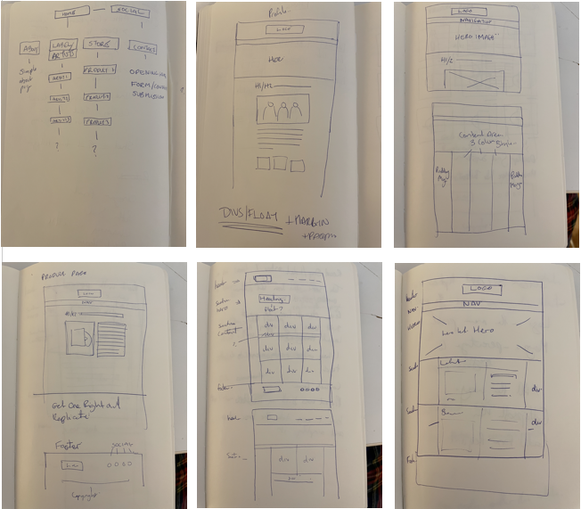

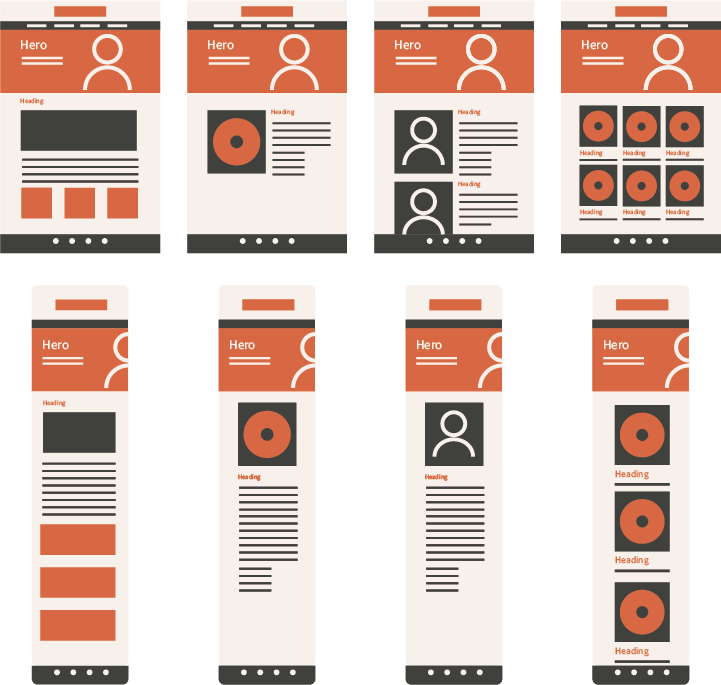

## 7. Technology Used
- HTML
- CSS

## 8. Testing 

Below are my results from testing the site both structually and visually.

### 8.1 Code Validation

- HTML
  - No errors were returned when passing through the official [W3C validator](https://jigsaw.w3.org/css-validator/validator?uri=https%3A%2F%2Ftberrigan2101.github.io%2Fproject-one%2Findex.html&profile=css3svg&usermedium=all&warning=1&vextwarning=&lang=en)
- CSS
  - No errors were found when passing through the official [(Jigsaw) validator](https://jigsaw.w3.org/css-validator/validator?uri=https%3A%2F%2Ftberrigan2101.github.io%2Fproject-one%2F&profile=css3svg&usermedium=all&warning=1&vextwarning=&lang=en)

### 8.2 User observations

- The people I tested the site with found the site easy to navigate and it felt relatively intuitive and the content made sense.

- One of the major issues that was flagged with me was that they thought the off-white background was too strong particulary against the organge text at a smaller size so I made it lighter and my original charcoal tint darker for the final product.

- The second was they felt that the mobile navigation was too small, was hard to read and difficult to tell what you were pressing. I was hoping to devlop a 'hamburger' or drop down menu but I was advised by by mentor that it may be too difficult to take on given the timescale so I opted to create a nav section that would float under the logo similar to the [Kids Coding](https://learn.codeinstitute.net/courses/course-v1:CodeInstitute+CSSE_PAGPPF+2021_Q2/courseware/66cf361c769a41d496f5001fae6f9be7/3b5cd5dc8313462aa5975a3c9b9a1a3c/) example. The original layout of the mobile navigation can be seen below.

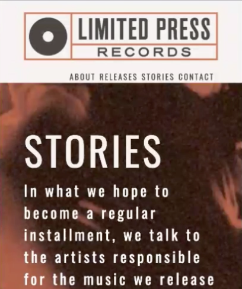

### 8.3 Fixed bugs

- I wanted to create a two column layout for certain pages of the site so the content wouldn't become stretched across the page. I originally tried to create code for the column layout through CSS and applying it in the HTML so it would be two floating horizontal sections on desktop/tablet and would stack under eachother on mobile but wasn't getting the results I wanted. See screenshots and code below.

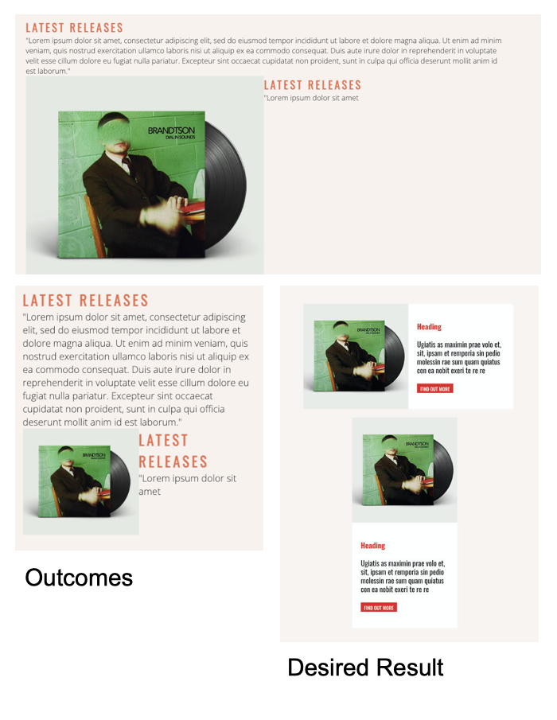

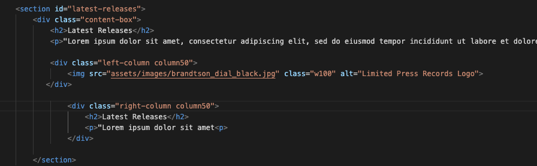

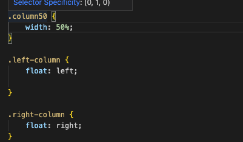

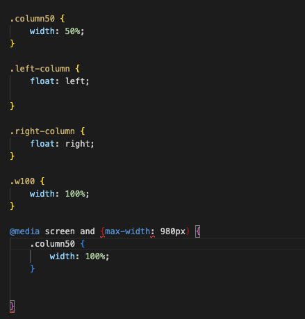

I then looked at some tutorials on W3 schools and was able to develop a solution from [here](https://www.w3schools.com/howto/howto_css_two_columns.asp)

- I also had some minor issues with the mobile layout of the text on the here images but I was able to adjust that making adjustments in Lighthouse and applying them to the code for the final piece.

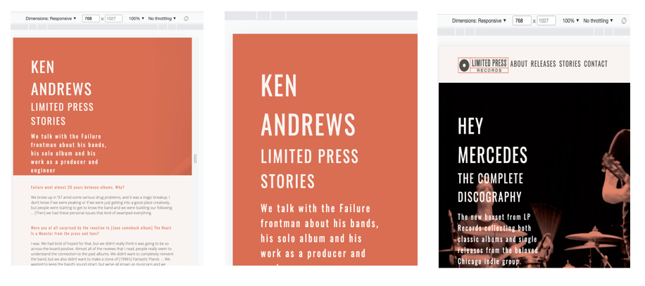

- There were also some typos and open bracket problems that were highlighted in the validators but they were easily corrected.

### 8.3 Unfixed bugs

I am still not happy with layout of the map on the 'Contact' section. I had it proportionally filling the left column using my two column grid method but I was using percentages for width to allow for mobile scaling as advised and the validator kept giving me an error using percentages due to the embedding code I used to source the map.

### 8.4 Supported Screens and Browsers

- I tested the site using Chrome, Safari and Firefox and all browsers tested fine.

### 8.5 Performance Testing

- Initial test for the site was good and there were a few small changes to be made, mostly image sizing however I decided to stop compressing the hero banners after 2 attempts as I felt the image was being comprimised too much.

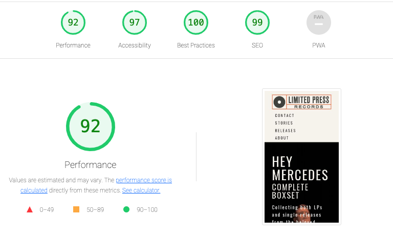

- A major performance issue I was having was due to the embedded Youtube videos on the individual Stories pages

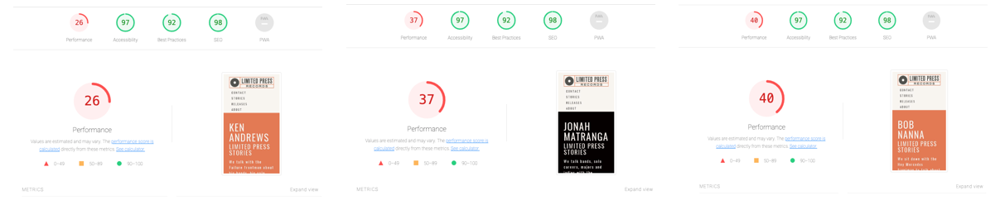

- This was due to javascript issues and I felt it was best to leave the videos out for now until I become more familiar with the solutions.

## 9. Deployment

- The site was deployed to GitHub pages. The steps to deploy are as follows: 
  - In the GitHub repository, navigate to the Settings tab 
  - From the source section drop-down menu, select the Master Branch
  - Once the master branch has been selected, the page will be automatically refreshed with a detailed ribbon display to indicate the successful deployment. 

The live link can be found here - 

## 10. Credits 

In this section I will break down the credits for my project. 

### 10.1 Code

- The footer and the three column float on the Home page for 'Latest Releases' and 'Latest Stories' was developed from the [Love Running](https://learn.codeinstitute.net/courses/course-v1:CodeInstitute+LR101+2021_T1/courseware/4a07c57382724cfda5834497317f24d5/f2db5fd401004fccb43b01a6066a5333/) project.

- The fix for my header navigation was developed from the solution in the [Kids Coding](https://learn.codeinstitute.net/courses/course-v1:CodeInstitute+CSSE_PAGPPF+2021_Q2/courseware/66cf361c769a41d496f5001fae6f9be7/3b5cd5dc8313462aa5975a3c9b9a1a3c/) example.

- The flexbox on the [Releases](https://tberrigan2101.github.io/project-one/releases.html) page I sourced from [here](https://www.w3schools.com/css/css3_flexbox.asp).

 - The code I used to develop the 'two column' layout on the individual album release pages, 'Contact' and all the 'Stories' pages I sourced from [here](https://www.w3schools.com/howto/howto_css_two_columns.asp)

### 10.2 Fonts

- All fonts were imported from [Google Fonts](https://fonts.google.com/about)

### 10.3 Written Content 

- All text on the [Homepage](https://tberrigan2101.github.io/project-one/index.html), the [About](https://tberrigan2101.github.io/project-one/about.html) page and on the hero images is written by me.

- The interview on [Bob Nanna Story](https://tberrigan2101.github.io/project-one/stories-bob-nanna.html) was adapted from [Alt Press](https://www.altpress.com/qananna/)

- The interview on [Jonah Matranga Story](https://tberrigan2101.github.io/project-one/stories-jonah-matranga.html) was adapted from [No Echo](https://www.noecho.net/interviews/jonah-matranga-far-onelinedrawing-new-end-original-gratitude)

- The interview on [Ken Andrews Story](https://tberrigan2101.github.io/project-one/stories-ken-andrews.html) was adapted from [Las Vegas Weekly](https://lasvegasweekly.com/ae/music/2015/oct/20/failure-ken-andrews-interview-vegas-fremont-club/)

- The album text on [Brandtson - Dial in Sounds](https://tberrigan2101.github.io/project-one/brandtson-dial-in-sounds.html) was adapted from [Deep Elm](http://www.deepelm.com/music/)

- The album text on [Engine Down - Demure](https://tberrigan2101.github.io/project-one/engine-down-demure.html) was adapted from [Lovitt](http://store.lovitt.com/artists/2-engine-down/product/27-demure-lov028)

- The album text on [Gratitude - Gratitude](https://tberrigan2101.github.io/project-one/gratitude-gratitude.html) was adapted from [The Punk Site](https://www.thepunksite.com/reviews/gratitude-self-titled/)

- The icons in the footer were taken from [Font Awesome](https://fontawesome.com/)

### 10.4 Media

- The company logo was created by me

- The images of all the records were taken from [Spotify](https://open.spotify.com/) and the mock ups were created using a mock up from [Graphic burger](https://graphicburger.com/vinyl-record-psd-mockup/)

- The images on the [Homepage](https://tberrigan2101.github.io/project-one/index.html) were taken from [Wikipedia](https://en.wikipedia.org/wiki/Ken_Andrews#/media/File:Ken_Andrews_2014.jpg), [Brooklyn Vegan](https://www.brooklynvegan.com/jonah-matranga-celebrating-new-book-playing-live-sets-on-fall-tour/), [Discogs](https://www.discogs.com/artist/447597-Bob-Nanna). The hero image was created using an image from [here](https://i.ytimg.com/vi/e8o_xaZh21k/maxresdefault.jpg). All images of the records were created using images as credited earlier.  

- The images and hero images on the [About](https://tberrigan2101.github.io/project-one/about.html) and [Contact](https://tberrigan2101.github.io/project-one/contact.html) were sourced from [Unsplash](https://unsplash.com)

- The hero images on the [Releases](https://tberrigan2101.github.io/project-one/releases.html) page and the album detail pages were were sourced from [Bandcamp](https://brandtson.bandcamp.com/music).

- The hero image on the [Stories](https://tberrigan2101.github.io/project-one/stories.html) was sourced from [Wikipedia](https://en.wikipedia.org/wiki/Engine_Down#/media/File:Engine_Down.jpg). The other images on this page have been cited above.

### 10.5 Acknowledgements

- I would like to thank my Code Institute mentor Rohit Sharma for all of his help throughout the project.
- My fellow students who helped me along the way.

